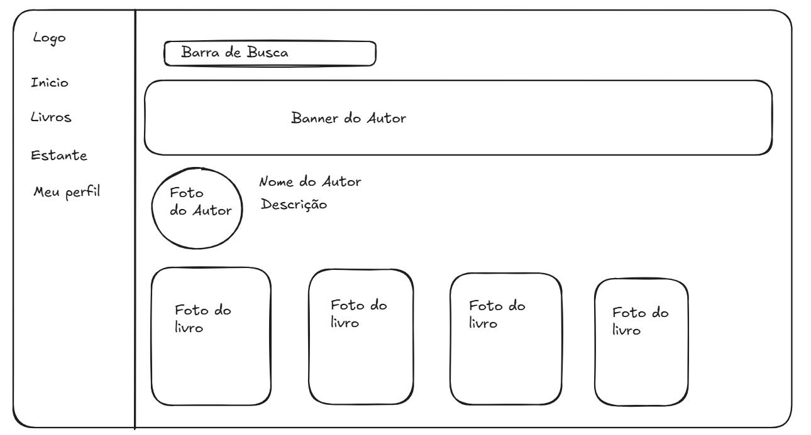
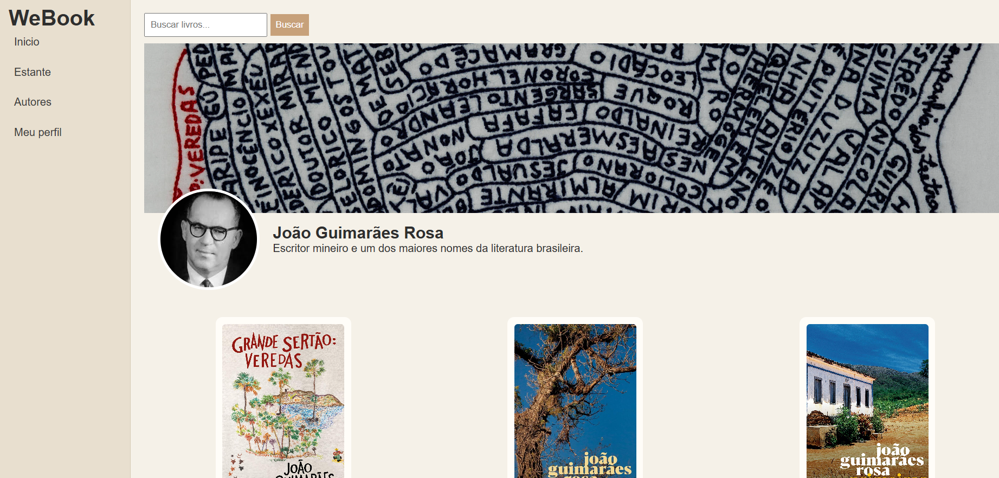

<<<<<<< HEAD

# Trabalho Prático - Semana 04

Dessa vez, vamos escolher uma proposta de projeto para trabalhar.

Nessa atividade, você deverá montar a página inicial do projeto escolhido, a organização do HTML aplicando semântica correta e uso aprimorado do CSS. Leia o enunciado completo no Canvas para mais detalhes.

**IMPORTANTE:** Você deve trabalhar e alterar apenas arquivos dentro da pasta **`public`**. Deixe todos os demais arquivos e pastas desse repositório inalterados. **PRESTE MUITA ATENÇÃO NISSO.**

## Informações Gerais

- Nome:Daniel Gomes Rolando
- Matricula:9262043
- Proposta de projeto escolhida:Site sobre o João Guimarães Rosa/ Livros
- Breve descrição sobre seu projeto:Fiz um site sobre o acervo do Guimarães Rosa e pretendo no futuro do projeto colocar mais autores

## Print do(s) wireframe(s) criado
> Sugestão, use o Excalidraw para isso. Utilize esse [template básico](https://excalidraw.com/#json=LU-8hwcQEwzk11FwO8Opo,qPU9K6cNUEzlXzwOuKMIlQ) para você começar. 

## Print da home-page criada

=======

# Trabalho Prático - Semana 5

Dessa vez, vamos dar sequência ao projeto iniciado na semana passada. Se você ainda não fez o projeto da semana anterior, fique atento, se programe e procure colocar as atividades em dia. Volte lá, leia tudo e faça sua parte pois essa atividade depende da atividade anterior..

Nessa atividade,vamos evoluir o projeto para que a home-page funcione bem tanto no celular quanto no desktop, entendendo também como é o processo gradativo e colaborativo de desenvolvimento de um software, registrando cada etapa no histórico de commits do repositório do git/GitHub.

**IMPORTANTE:** Você deve trabalhar e alterar apenas arquivos dentro da pasta **`public`,** mantendo os arquivos **`index.html`** e **`styles.css`** com estes nomes. Deixe todos os demais arquivos e pastas desse repositório inalterados. **PRESTE MUITA ATENÇÃO NISSO.**

## Informações Gerais

- Nome:
- Matricula:
- Proposta de projeto escolhida:
- Breve descrição sobre seu projeto:

## Print da versão responsiva com CSS puro [DESKTOP]

<<  COLOQUE A IMAGEM AQUI >>

## Print da versão responsiva com CSS puro [MOBILE] (*)

<<  COLOQUE A IMAGEM AQUI >>

(*) Utilize as ferramentas do desenvolvedor do seu navegador para colocar no modo reponsivo, escolha um celular qualquer e recarregue a página antes de tirar o print. 
>>>>>>> f4e91bfcd00f0cf9bfe30143dd8849a8a14f2f83
